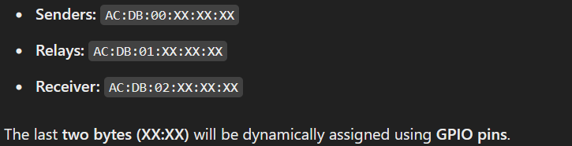
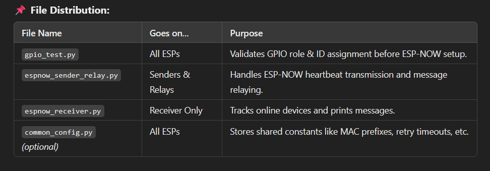
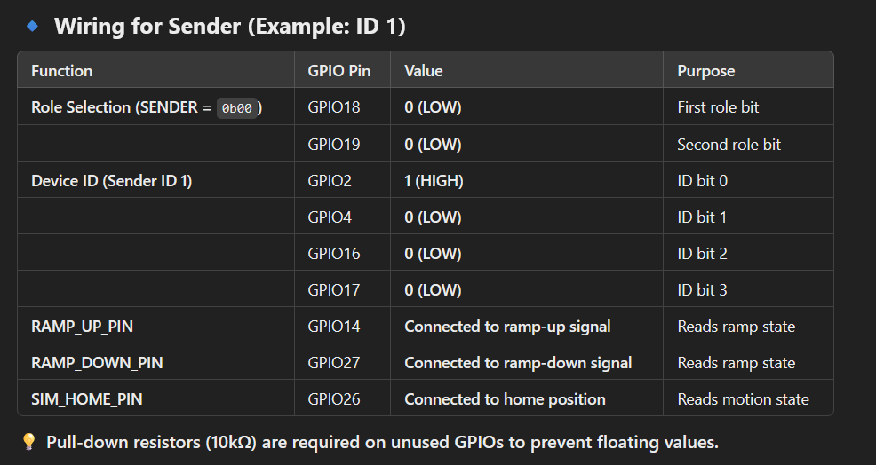
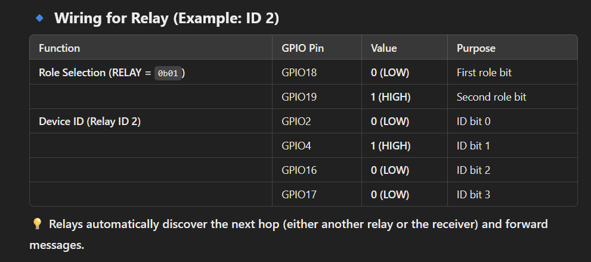
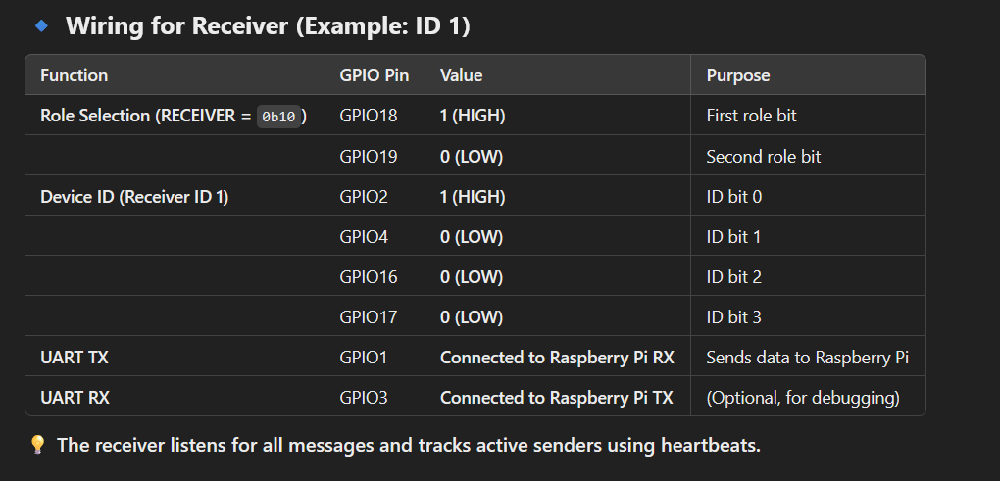

# SimMonitoring Overview

Rename the main script to main.py
'''bash
mv espnow_sender_relay.py main.py
'''

Flash it to the ESP32:
'''bash
mpremote connect /dev/ttyUSB0 fs cp main.py :
'''

Reset the ESP32 to run it automatically:
'''bash
mpremote connect /dev/ttyUSB0 reset
'''

If you want manual execution, you can run any script interactively:
'''bash
mpremote connect /dev/ttyUSB0 run gpio_test.py
'''

## Wiring Guide for Each ESP32 Device

# ESP32 Device ID Configuration for Sender

Below is a quick reference for how to wire **GPIO17**, **GPIO16**, **GPIO4**, and **GPIO2** to assign a **device ID** (0–15). Each pin is interpreted as a bit in the 4-bit ID, read in the order `(Pin2=bit0, Pin4=bit1, Pin16=bit2, Pin17=bit3)`.

| Device ID | Binary (bit3..bit0) | Pin17 (bit3) | Pin16 (bit2) | Pin4 (bit1) | Pin2 (bit0) |
|-----------|----------------------|--------------|--------------|-------------|-------------|
| **0**     | `0000`              | 0 (LOW)      | 0 (LOW)      | 0 (LOW)     | 0 (LOW)     |
| **1**     | `0001`              | 0 (LOW)      | 0 (LOW)      | 0 (LOW)     | 1 (HIGH)    |
| **2**     | `0010`              | 0 (LOW)      | 0 (LOW)      | 1 (HIGH)    | 0 (LOW)     |
| **3**     | `0011`              | 0 (LOW)      | 0 (LOW)      | 1 (HIGH)    | 1 (HIGH)    |
| **4**     | `0100`              | 0 (LOW)      | 1 (HIGH)     | 0 (LOW)     | 0 (LOW)     |
| **5**     | `0101`              | 0 (LOW)      | 1 (HIGH)     | 0 (LOW)     | 1 (HIGH)    |
| **6**     | `0110`              | 0 (LOW)      | 1 (HIGH)     | 1 (HIGH)    | 0 (LOW)     |
| **7**     | `0111`              | 0 (LOW)      | 1 (HIGH)     | 1 (HIGH)    | 1 (HIGH)    |
| **8**     | `1000`              | 1 (HIGH)     | 0 (LOW)      | 0 (LOW)     | 0 (LOW)     |
| **9**     | `1001`              | 1 (HIGH)     | 0 (LOW)      | 0 (LOW)     | 1 (HIGH)    |
| **10**    | `1010`              | 1 (HIGH)     | 0 (LOW)      | 1 (HIGH)    | 0 (LOW)     |
| **11**    | `1011`              | 1 (HIGH)     | 0 (LOW)      | 1 (HIGH)    | 1 (HIGH)    |
| **12**    | `1100`              | 1 (HIGH)     | 1 (HIGH)     | 0 (LOW)     | 0 (LOW)     |
| **13**    | `1101`              | 1 (HIGH)     | 1 (HIGH)     | 0 (LOW)     | 1 (HIGH)    |
| **14**    | `1110`              | 1 (HIGH)     | 1 (HIGH)     | 1 (HIGH)    | 0 (LOW)     |
| **15**    | `1111`              | 1 (HIGH)     | 1 (HIGH)     | 1 (HIGH)    | 1 (HIGH)    |

## Notes

1. **GPIO2** is the **least significant bit** (bit0).  
2. **GPIO17** is the **most significant bit** (bit3).  
3. Use **10kΩ resistors** (or internal pulls) to pull each pin HIGH or LOW.  
4. For a **Sender** role, set **GPIO18 = 0 (LOW)** and **GPIO19 = 0 (LOW)**. This yields `role_value = 0` => `"SENDER"`.

