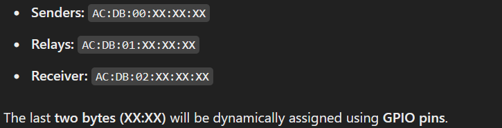
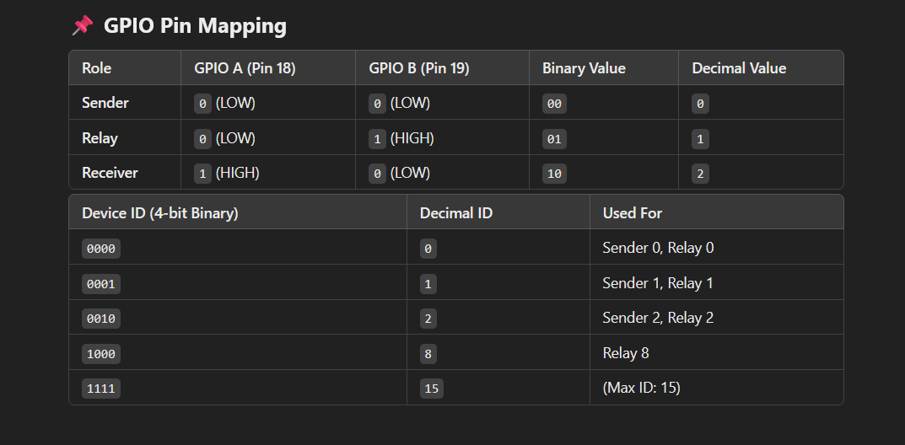
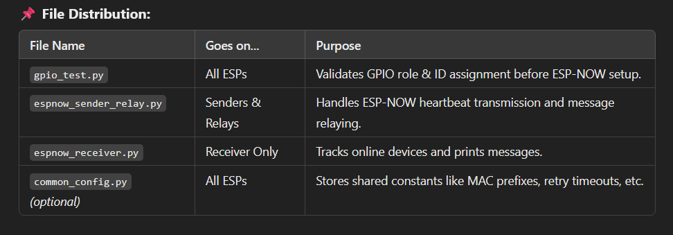
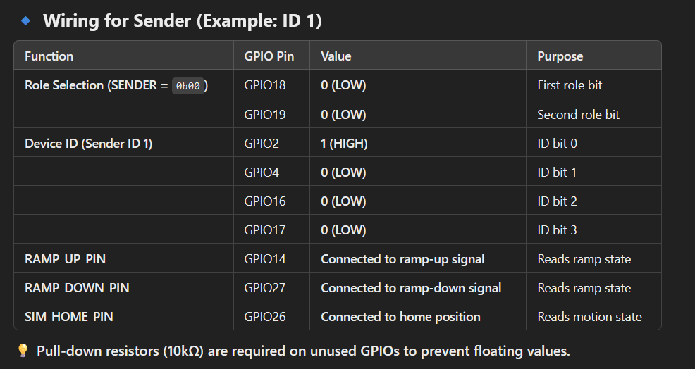
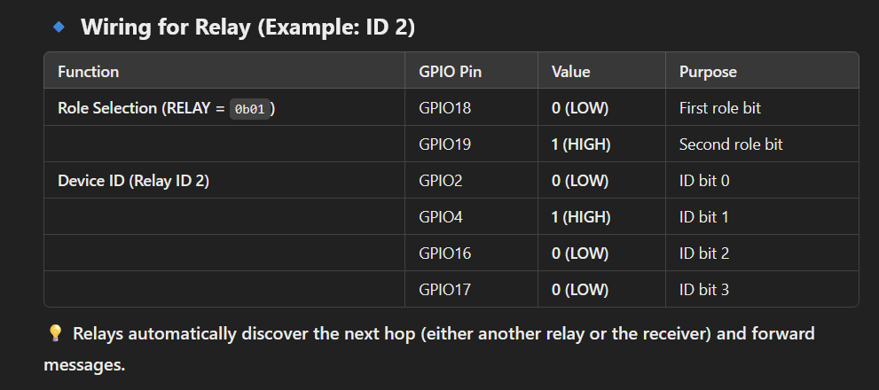
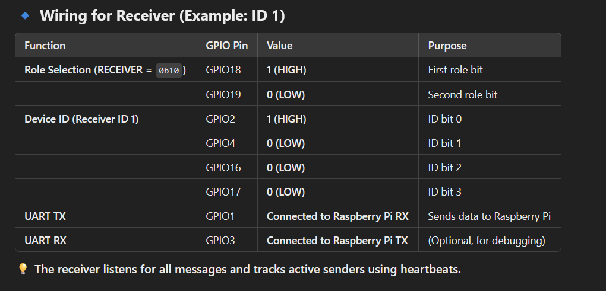

# SimMonitoring Overview

Rename the main script to main.py
'''bash
mv espnow_sender_relay.py main.py
'''

Flash it to the ESP32:
'''bash
mpremote connect /dev/ttyUSB0 fs cp main.py :
'''

Reset the ESP32 to run it automatically:
'''bash
mpremote connect /dev/ttyUSB0 reset
'''

If you want manual execution, you can run any script interactively:
'''bash
mpremote connect /dev/ttyUSB0 run gpio_test.py
'''

## Wiring Guide for Each ESP32 Device

